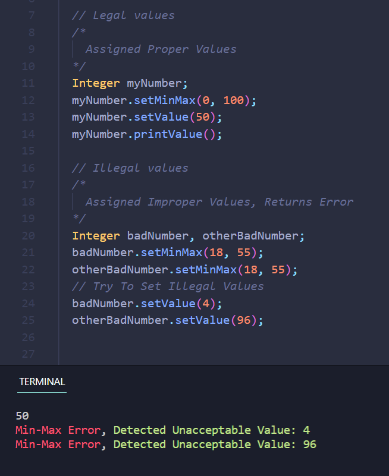

  

<h1 align="center">Integer-Class-For-CPP</h1>

  Simple Integer Class With Some Useful Functions :)

  Read about list of all functions <a href="FUNCTIONS.md">here</a>.

# Latest Updates

<b>
v 1.14  + Added Min-Max Function
</b>

- Min-Max that is  `setMinMax(int min, int max);` function helps you to set minimum & maximum for an integre variable.
- You can use `setMin(int min);` & `setMax(int max);` functions seperately.
  
Here's and Example: 
<a href="src/usageExample.cpp">Click Here</a> For Program Code Shown in the image below.

  

