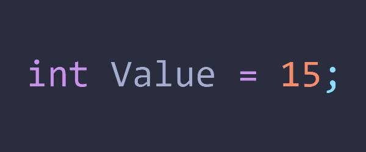

  

<h1 align="center">Integer-Class-For-CPP</h1>

  Simple Integer Class With Some Useful Functions :)

# List Of Functions Included In Class

  - Global 
  me.clear(); - Clears the console screen(both Windows/Linux Compatable)

  - 1: Converts a Integer to String 
  string toString();

  - 2: Converts a Integer to HexString 
  // Not Available

  - 3: Converts a Integer to OctalString 
  // Not Available

  - 4: Converts a Integer to BinaryString 
  // Not Available

  - 5: Returns value of Integer & Sets Value of an Integer 
  int valueOf();
  int getValue();
  void printValue();
  void setValue(int num);

  - 6: Returns float Value of an Integer 
  float floatValue();

  - 7: Returns double Value of an Integer 
  double doubleValue();

  - 8: Returns long Value of an Integer 
  long longValue();

  - 9: Returns int Value of an Integer 
  int intValue();

  - 10: Returns short Value of an Integer 
  short shortValue();

  - 11: Returns byte Value of an Integer 
  char byteValue();

  - 12: Returns True if Integer is Even 
  bool isEven();

  - 13: Returns True if Integer is Odd 
  bool isOdd();

  - 14: Returns True if Integer is Prime 
  bool isPrime();

  - 15: Returns True if Integer is Palindrome 
  bool isPalindrome();

  - 16: Returns reverse Integer Value 
  int reverse();

  - 17: Returns True if Integer is equals to reference Integer 
  bool equals(int value); 
  bool equals(string value);
